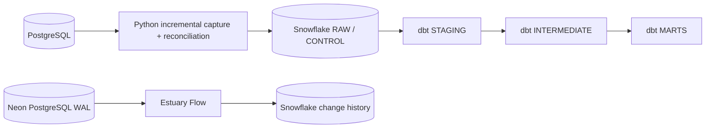

# Pet Insurance Claims & Portfolio Data Platform

Production-style data platform for mutable pet-insurance data, with incremental history capture and database change tracking.

## Problem

Operational PostgreSQL records change after creation: claims progress through states, approved amounts change, payments arrive later, customer attributes change, and rows can be soft-deleted. A simple overwrite or timestamp-only batch can lose history or miss late data.

GitHub Actions provides CI/CD and Snowflake OIDC. Docker provides a reproducible PostgreSQL source. Dagster proves the same dependency chain can be expressed as an orchestrated workload.

### How the data platform is divided

PostgreSQL and Snowflake deliberately serve different workloads. PostgreSQL is the operational relational database: the application creates and updates customers, policies, claims and payments there. Snowflake is the analytical warehouse: larger transformations, historical analysis and reporting run there instead of competing with the operational application for CPU, memory, I/O and database connections.

**Change data capture (CDC)** means detecting source changes—such as inserts, updates and deletes—and propagating those changes downstream rather than repeatedly copying the entire source. For example, when a claim moves from `SUBMITTED` to `APPROVED` to `PAID`, a CDC path can preserve those events downstream. Estuary Flow is the managed integration tool used here to read PostgreSQL's logical change stream and materialize it into Snowflake; CDC is the pattern, while Estuary is one implementation of that pattern.

The first analytical landing area is **RAW**. RAW keeps incoming source versions close to what was received so later transformations can be audited, debugged and rebuilt. It is not treated as a database backup: backup and disaster recovery are separate operational concerns.

**dbt** then runs SQL transformations inside Snowflake. It turns source-oriented RAW records into typed staging models, reusable intermediate models and business-facing **marts**. A mart is a curated analytical dataset designed around a business question or reporting need, rather than a copy of the operational schema.

A second executed path reads PostgreSQL change events from the database log:

~~~text
Neon PostgreSQL
  → logical replication / WAL
  → Estuary Flow
  → Snowflake PET_INSURANCE_ESTUARY.CLAIMS
~~~

## Documentation

- [Theory and architecture](docs/theory_and_architecture.md) — concepts and design
- [Reproduction](docs/reproduction.md) — commands to rebuild and verify the system
- [Runbook](docs/runbook.md) — operations and recovery
- [Evidence](docs/evidence/) — executed verification results

## Technology roles

| Technology / concept | Role in this project |
| --- | --- |
| SQL | Language used to define, query, transform and test relational data |
| PostgreSQL | Operational relational source containing customers, pets, policies, claims and payments |
| Python | Incremental extraction, version identity, batching, reconciliation and reliability logic |
| Snowflake | Analytical warehouse holding RAW history, CONTROL state and dbt models |
| dbt | SQL transformation, testing, contracts, lineage and analytical modeling inside Snowflake |
| Git | Version-control system that records the repository's change history |
| GitHub | Repository host and automation platform; GitHub Actions runs CI and proof workflows |
| Docker | Reproducible local PostgreSQL runtime |
| Dagster | Orchestration proof for dependency ordering and retries |
| Neon | Managed PostgreSQL source used for the logical-replication/WAL CDC proof |
| Estuary Flow | Managed CDC platform that reads Neon WAL changes and materializes history into Snowflake |
| BigQuery | Independent GCP analytical-warehouse proof using deterministic batch loading and reconciliation |

See [docs/theory_and_architecture.md](docs/theory_and_architecture.md) for the architecture and core concepts used here.

## Current verified evidence

- Live PostgreSQL → Snowflake set-based ingestion: PASS
- Transaction rollback after RAW MERGE / before watermark: PASS
- New-key late arrival recovery: PASS
- Existing-key late-version recovery: PASS
- Duplicate / no-change replay: PASS
- Soft-delete propagation: PASS
- Additive schema evolution: PASS
- Breaking schema change rejection: PASS
- Customer SCD2 history: PASS
- Security gate (gitleaks + dependency audit + Ruff): PASS
- Dagster orchestration proof: PASS
- Controlled scale benchmark: PASS
- Estuary WAL capture: INSERT / UPDATE / physical DELETE PASS
- Estuary → Snowflake materialization: PASS
- Snowflake Estuary history: 1 create + 1 update + 1 delete for the disposable CDC claim
- GCP BigQuery Sandbox reconciliation: PASS
- Python tests: 25 passed
- dbt: 11 models + 67 tests; 78/78 build nodes passed

Executed evidence is indexed in [docs/evidence/](docs/evidence/).

## Focal claim history

| State | Claim amount | Approved | Paid |
| --- | ---: | ---: | ---: |
| SUBMITTED | R8,500 | — | — |
| APPROVED | R11,200 | R9,700 | — |
| PAID | R11,200 | R9,700 | R9,700 |

CLM-10042 preserves all three states. An unchanged replay inserts zero new versions.

## Ingestion design

Normal fast path:

- validate the PostgreSQL source contract;
- read a composite (updated_at, primary_key) watermark;
- canonicalize and SHA-256 hash source payloads;
- stage rows in batches;
- execute one set-based Snowflake MERGE per table;
- commit RAW + watermark + SUCCESS audit atomically;
- clean stage rows;
- expose operational state through INGESTION_HEALTH.

Correctness path:

- compare the full current source-version identity (table, primary key, source_updated_at, payload_hash);
- recover new or changed versions that arrived behind the high watermark;
- replay reconciliation without duplication.

See [run_ingestion.py](src/insurance_platform/run_ingestion.py) and [reconcile_source_state.py](src/insurance_platform/reconcile_source_state.py). The underlying design is summarized in [docs/theory_and_architecture.md](docs/theory_and_architecture.md).

## Transaction failure proof

The atomicity workflow deliberately raises an exception after the claims RAW MERGE and before watermark update.

Verified result: RAW rolled back; the watermark did not advance; the FAILED batch audit remained; stage rows were cleaned; normal retry loaded the source version once; a final unchanged replay inserted zero rows.

Evidence: [transaction_atomicity.md](docs/evidence/transaction_atomicity.md).

## Data contracts and governance

Versioned source contracts live in [contracts/](contracts/). They enforce required columns, types, nullability and primary keys while allowing logged additive fields.

Schema-evolution CI proves an additive submission_channel field is accepted and preserved while an incompatible nullability change is rejected.

Direct customer names are kept out of analytics marts. dbt also tests cross-entity insurance integrity, accepted values, payment limits, claim/policy dates and the PII boundary.

## Scale proof

A clean benchmark generated and loaded 82,956 rows:

- 10,000 customers
- 14,916 pets
- 14,916 policies
- 29,828 claims
- 13,296 claim payments

First set-based ingestion reconciled every row. The immediate second run produced zero candidates and zero inserts across all five tables.

At the tested size, the benchmark verifies complete ingestion and zero-duplicate replay behavior.

Evidence: [scale_benchmark.md](docs/evidence/scale_benchmark.md).

## dbt

Layering: RAW → STAGING → INTERMEDIATE → MARTS.

Key models include typed staging models, backfill-safe int_claim_events, int_policy_claims, fct_claims, dim_policy, one intentional customer SCD2 and mart_portfolio_performance.

The paid loss-ratio proxy uses current monthly premium annualized by twelve because earned-premium exposure is not present in the source data.

## Security and reproducibility

- Snowflake uses GitHub OIDC; no Snowflake password is stored.
- PostgreSQL DSN is an Actions secret.
- Python toolchain has a committed tested dependency lock.
- gitleaks scans full history.
- pip-audit reported no known vulnerabilities in the verified run.
- Docker boots and validates a clean source schema.
- Makefile provides zero-to-green local commands.
- [docs/runbook.md](docs/runbook.md) contains diagnosis and recovery procedures.

Verified Snowflake trial compute: Standard X-Small, auto-resume enabled, auto-suspend 300 seconds.

The verified trial uses SNOWFLAKE_LEARNING_ROLE. A separate least-privilege production role bootstrap remains documented as PROPOSED.

## External integrations

- **Estuary Flow — VERIFIED.** Live Neon runs with `wal_level=logical`; Estuary captures PostgreSQL WAL events in History Mode; a controlled claim produced create, update and physical-delete events; the Estuary collection was materialized into Snowflake; Snowflake contains exactly one `c`, one `u` and one `d` event for the disposable claim. See [docs/evidence/estuary_cdc.md](docs/evidence/estuary_cdc.md).
- **Google Cloud — VERIFIED via BigQuery Sandbox.** A no-billing Cloud Shell proof created and loaded a typed BigQuery dataset/table and reconciled warehouse aggregates against a deterministic source manifest. See [docs/evidence/gcp_bigquery_sandbox.md](docs/evidence/gcp_bigquery_sandbox.md).
- **GCS → Snowflake extension — implementation retained.** The available GCP projects have billing disabled, so the provider-side bucket and transfer path were not run.

See [docs/external_integrations.md](docs/external_integrations.md) for the exact verification boundary.

## Engineering safeguards verified

The final implementation deliberately verifies the failure modes that matter to correctness rather than treating a green happy-path run as sufficient:

- deterministic Decimal/date serialization and payload hashing;
- connector-safe staged JSON binding;
- composite watermark ordering;
- non-regressing progress for late source versions;
- full-state recovery of new and changed late versions;
- transaction rollback between RAW MERGE and watermark advancement;
- idempotent unchanged replay;
- additive schema evolution and breaking-change rejection;
- soft-delete propagation;
- data-quality and PII boundaries.

These are controlled verification scenarios; implementation details are proven by the code, tests and [evidence](docs/evidence/).

## Quick start

~~~bash
make bootstrap
make test
make postgres-up
make postgres-smoke
make postgres-down
~~~

See [docs/reproduction.md](docs/reproduction.md) for live Snowflake execution.

## Five-minute review path

1. Architecture and verified results in this README
2. [Evidence index](docs/evidence/README.md)
3. [Ingestion code](src/insurance_platform/run_ingestion.py) and [reconciliation](src/insurance_platform/reconcile_source_state.py)
4. [dbt models](dbt/models/)
5. [Runbook](docs/runbook.md) and [architecture decisions](docs/adr/)
6. GitHub Actions: Platform CI, Reliability, Transaction Atomicity, Scale Benchmark, Security, Dagster and Estuary CDC
