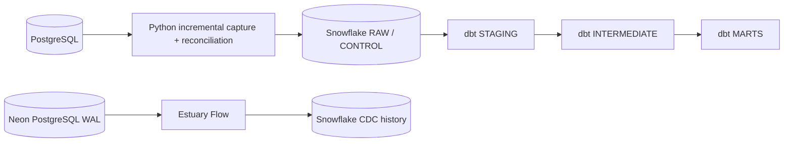

# Pet Insurance Claims & Portfolio Data Platform

Production-style ELT / CDC capability proof for a mutable pet-insurance workload.

## Problem

Operational PostgreSQL records change after creation: claims progress through states, approved amounts change, payments arrive later, customer attributes change, and rows can be soft-deleted. A simple overwrite or timestamp-only batch can lose history or miss late data.

GitHub Actions provides CI/CD and Snowflake OIDC. Docker provides a reproducible PostgreSQL source. Dagster proves the same dependency chain can be expressed as an orchestrated workload.

A second executed path proves managed log-based CDC:

~~~text
Neon PostgreSQL
  → logical replication / WAL
  → Estuary Flow
  → Snowflake PET_INSURANCE_ESTUARY.CLAIMS
~~~

## How to read this repository

Two reading paths are provided deliberately:

- **Technical reviewer:** stay in this README, then use [docs/evidence/](docs/evidence/), [docs/runbook.md](docs/runbook.md) and the implementation files linked below.
- **Learner / candidate preparing to defend the project:** start with [docs/engineering_walkthrough.md](docs/engineering_walkthrough.md), use [docs/concepts.md](docs/concepts.md) whenever a term is unfamiliar, then study the core pipeline function-by-function in [docs/ingestion_deep_dive.md](docs/ingestion_deep_dive.md).

The walkthrough maps the project from data-analyst skills through analytics engineering into data engineering. The concepts guide defines the technologies in project context rather than assuming prior platform knowledge.

### Required technical deep dives

| Deep dive | What it teaches |
| --- | --- |
| [PostgreSQL, SQL and source contracts](docs/postgres_sql_contracts_deep_dive.md) | relational modeling, keys, constraints, types, indexes, Docker source reproduction, information_schema, contracts and schema compatibility |
| [Ingestion: PostgreSQL → Snowflake](docs/ingestion_deep_dive.md) | ChangeRecord semantics, canonical hashing, composite watermarks, staging, MERGE, transactions, retries and reconciliation |
| [dbt, Snowflake modeling and business SQL](docs/dbt_modeling_deep_dive.md) | grain, current-state reconstruction, joins, facts/dimensions, SCD2, marts, contracts and business tests |
| [Git, GitHub, CI/CD, security and OIDC](docs/git_ci_security_deep_dive.md) | version control, Actions, CI jobs, artifacts, Docker verification, workload identity, secret scanning and dependency security |
| [Neon, PostgreSQL WAL and Estuary CDC](docs/estuary_cdc_deep_dive.md) | WAL, logical replication, publications, direct Neon connectivity, managed C/U/D capture and Snowflake materialization |

These documents are part of the project deliverable: they explain the exact implementation, why each component exists, its failure behavior, its trade-offs and the competency demonstrated.

## Technology roles

| Technology / concept | Role in this project |
| --- | --- |
| SQL | Language used to define, query, transform and test relational data |
| PostgreSQL | Operational relational source containing customers, pets, policies, claims and payments |
| Python | Incremental extraction, version identity, batching, reconciliation and reliability logic |
| Snowflake | Analytical warehouse holding RAW history, CONTROL state and dbt models |
| dbt | SQL transformation, testing, contracts, lineage and analytical modeling inside Snowflake |
| Git | Version-control system that records the repository's change history |
| GitHub | Repository host and automation platform; GitHub Actions runs CI and proof workflows |
| Docker | Reproducible local PostgreSQL runtime |
| Dagster | Orchestration proof for dependency ordering and retries |
| Neon | Managed PostgreSQL source used for the logical-replication/WAL CDC proof |
| Estuary Flow | Managed CDC platform that reads Neon WAL changes and materializes history into Snowflake |
| BigQuery | Independent GCP analytical-warehouse proof using deterministic batch loading and reconciliation |

See [docs/concepts.md](docs/concepts.md) for precise definitions of CDC, WAL, watermarks, idempotency, MERGE, reconciliation, SCD2, OIDC and related terms.

## Current verified evidence

- Live PostgreSQL → Snowflake set-based ingestion: PASS
- Transaction rollback after RAW MERGE / before watermark: PASS
- New-key late arrival recovery: PASS
- Existing-key late-version recovery: PASS
- Duplicate / no-change replay: PASS
- Soft-delete propagation: PASS
- Additive schema evolution: PASS
- Breaking schema change rejection: PASS
- Customer SCD2 history: PASS
- Security gate (gitleaks + dependency audit + Ruff): PASS
- Dagster orchestration proof: PASS
- Controlled scale benchmark: PASS
- Estuary WAL capture: INSERT / UPDATE / physical DELETE PASS
- Estuary → Snowflake materialization: PASS
- Snowflake Estuary history: 1 create + 1 update + 1 delete for the disposable CDC claim
- GCP BigQuery Sandbox reconciliation: PASS
- Python tests: 25 passed
- dbt: 11 models + 67 tests; 78/78 build nodes passed

Executed evidence is indexed in [docs/evidence/](docs/evidence/).

## Focal claim history

| State | Claim amount | Approved | Paid |
| --- | ---: | ---: | ---: |
| SUBMITTED | R8,500 | — | — |
| APPROVED | R11,200 | R9,700 | — |
| PAID | R11,200 | R9,700 | R9,700 |

CLM-10042 preserves all three states. An unchanged replay inserts zero new versions.

## Ingestion design

Normal fast path:

- validate the PostgreSQL source contract;
- read a composite (updated_at, primary_key) watermark;
- canonicalize and SHA-256 hash source payloads;
- stage rows in batches;
- execute one set-based Snowflake MERGE per table;
- commit RAW + watermark + SUCCESS audit atomically;
- clean stage rows;
- expose operational state through INGESTION_HEALTH.

Correctness path:

- compare the full current source-version identity (table, primary key, source_updated_at, payload_hash);
- recover new or changed versions that arrived behind the high watermark;
- replay reconciliation without duplication.

See [run_ingestion.py](src/insurance_platform/run_ingestion.py) and [reconcile_source_state.py](src/insurance_platform/reconcile_source_state.py). A function-by-function explanation of the exact SQL, transaction boundary, replay behavior, late-data recovery and CLM-10042 flow is in [docs/ingestion_deep_dive.md](docs/ingestion_deep_dive.md).

## Transaction failure proof

The atomicity workflow deliberately raises an exception after the claims RAW MERGE and before watermark update.

Verified result: RAW rolled back; the watermark did not advance; the FAILED batch audit remained; stage rows were cleaned; normal retry loaded the source version once; a final unchanged replay inserted zero rows.

Evidence: [transaction_atomicity.md](docs/evidence/transaction_atomicity.md).

## Data contracts and governance

Versioned source contracts live in [contracts/](contracts/). They enforce required columns, types, nullability and primary keys while allowing logged additive fields.

Schema-evolution CI proves an additive submission_channel field is accepted and preserved while an incompatible nullability change is rejected.

Direct customer names are kept out of analytics marts. dbt also tests cross-entity insurance integrity, accepted values, payment limits, claim/policy dates and the PII boundary.

## Scale proof

A clean benchmark generated and loaded 82,956 rows:

- 10,000 customers
- 14,916 pets
- 14,916 policies
- 29,828 claims
- 13,296 claim payments

First set-based ingestion reconciled every row. The immediate second run produced zero candidates and zero inserts across all five tables.

This is a controlled scale test, not an enterprise-throughput claim.

Evidence: [scale_benchmark.md](docs/evidence/scale_benchmark.md).

## dbt

Layering: RAW → STAGING → INTERMEDIATE → MARTS.

Key models include typed staging models, backfill-safe int_claim_events, int_policy_claims, fct_claims, dim_policy, one intentional customer SCD2 and mart_portfolio_performance.

The loss-ratio field is explicitly a proxy, not an actuarial earned-premium loss ratio.

## Security and reproducibility

- Snowflake uses GitHub OIDC; no Snowflake password is stored.
- PostgreSQL DSN is an Actions secret.
- Python toolchain has a committed tested dependency lock.
- gitleaks scans full history.
- pip-audit reported no known vulnerabilities in the verified run.
- Docker boots and validates a clean source schema.
- Makefile provides zero-to-green local commands.
- [docs/runbook.md](docs/runbook.md) contains diagnosis and recovery procedures.

Verified Snowflake trial compute: Standard X-Small, auto-resume enabled, auto-suspend 300 seconds.

The live trial uses SNOWFLAKE_LEARNING_ROLE. A least-privilege production role bootstrap is documented as PROPOSED, not falsely presented as deployed.

## External integrations

- **Estuary Flow — VERIFIED.** Live Neon runs with `wal_level=logical`; Estuary captures PostgreSQL WAL events in History Mode; a controlled claim produced create, update and physical-delete events; the Estuary collection was materialized into Snowflake; Snowflake contains exactly one `c`, one `u` and one `d` event for the disposable claim. See [docs/evidence/estuary_cdc.md](docs/evidence/estuary_cdc.md).
- **Google Cloud — VERIFIED via BigQuery Sandbox.** A no-billing Cloud Shell proof created and loaded a typed BigQuery dataset/table and reconciled warehouse aggregates against a deterministic source manifest. See [docs/evidence/gcp_bigquery_sandbox.md](docs/evidence/gcp_bigquery_sandbox.md).
- **GCS → Snowflake extension — NOT EXECUTED.** The production-style WIF/GCS/Snowflake implementation remains in the repo, but the available GCP projects have billing disabled, so GCS bucket creation is blocked by the provider.

See [docs/external_integrations.md](docs/external_integrations.md) for the exact verification boundary.

## Engineering safeguards verified

The final implementation deliberately verifies the failure modes that matter to correctness rather than treating a green happy-path run as sufficient:

- deterministic Decimal/date serialization and payload hashing;
- connector-safe staged JSON binding;
- composite watermark ordering;
- non-regressing progress for late source versions;
- full-state recovery of new and changed late versions;
- transaction rollback between RAW MERGE and watermark advancement;
- idempotent unchanged replay;
- additive schema evolution and breaking-change rejection;
- soft-delete propagation;
- data-quality and PII boundaries.

These are controlled verification scenarios. The canonical implementation path is documented in [docs/engineering_walkthrough.md](docs/engineering_walkthrough.md).

## Quick start

~~~bash
make bootstrap
make test
make postgres-up
make postgres-smoke
make postgres-down
~~~

See [docs/reproduction.md](docs/reproduction.md) for live Snowflake execution.

## Five-minute review path

1. Start here: architecture, verified evidence and explicit limitations in this README.
2. Evidence index: [docs/evidence/README.md](docs/evidence/README.md).
3. Ingestion mechanics: [run_ingestion.py](src/insurance_platform/run_ingestion.py) and [reconcile_source_state.py](src/insurance_platform/reconcile_source_state.py).
4. Analytical modeling: [dbt/models/](dbt/models/).
5. Operations and decisions: [docs/runbook.md](docs/runbook.md) and [docs/adr/](docs/adr/).
6. GitHub Actions proof: Platform CI, Reliability Failure Suite, Transaction Atomicity, Scale Benchmark, Security Gate, Dagster Orchestration Proof and Estuary CDC Mutation Proof.

One-off diagnostic workflows used during development were intentionally removed from the final review surface; their executed run history and evidence remain documented.

## Deliberate non-goals

Kafka, Spark, Kubernetes and a permanent orchestration service are not added merely to increase technology count. They should be introduced only when latency, scale, topology or operational requirements justify them.
