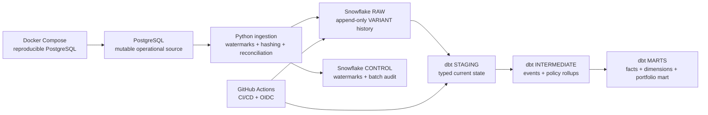

# Pet Insurance Claims & Portfolio Data Platform

[](https://github.com/NiknaxTheGreek/pet-insurance-data-platform/actions/workflows/platform-ci.yml)
[](https://github.com/NiknaxTheGreek/pet-insurance-data-platform/actions/workflows/reliability-suite.yml)
[](https://github.com/NiknaxTheGreek/pet-insurance-data-platform/actions/workflows/dbt-build.yml)

A production-style data-engineering project for a mutable pet-insurance workload.

Operational customer, pet, policy, claim and payment records originate in PostgreSQL and are incrementally propagated into Snowflake, transformed with dbt, tested, documented and exposed as trusted analytical datasets.

The implementation focuses on **incremental processing, CDC semantics, historical correctness, idempotency, reconciliation, data quality, observability, testing and CI/CD** rather than simply connecting tools together.

## Business problem

A pet insurer stores operational data in PostgreSQL. Policies are amended, claims change state and amount, payments arrive later, customer attributes change, and records can be cancelled or soft-deleted.

Simple periodic snapshots risk stale, duplicated or historically incorrect analytics.

The platform answers:

> How is the pet-insurance portfolio performing, and which segments are driving changes in claims performance?

## Architecture



Data path:

`PostgreSQL → Python incremental ingestion → Snowflake RAW/CONTROL → dbt STAGING → INTERMEDIATE → MARTS`

## What is actually verified

### End-to-end claim development

`CLM-10042` is preserved through three source states:

| State | Claim amount | Approved | Paid |
| --- | ---: | ---: | ---: |
| SUBMITTED | R8,500 | — | — |
| APPROVED | R11,200 | R9,700 | — |
| PAID | R11,200 | R9,700 | R9,700 |

The live T4 run detected exactly one changed claim and one new payment. The immediate replay detected **0 candidates / 0 inserts across all five source tables**.

### Historical customer change

A real customer attribute change was propagated:

- historical: `CUS-00001` — Gauteng
- current: `CUS-00001` — Western Cape

`DIM_CUSTOMER_SCD2` contains one closed historical row and one current row.

### Controlled failure and recovery

The reliability suite deliberately proves failure handling:

- invalid payment date → dbt test fails with exactly one bad row
- repair → incremental reload → dbt test passes
- deliberately late claim → normal watermark scan misses it
- reconciliation/backfill → missing claim recovered exactly once
- backfill replay → zero duplicates
- soft delete → RAW operation becomes `DELETE`
- deleted claim disappears from `FCT_CLAIMS`
- final no-change replay → zero extracted / zero inserted

See [docs/reliability.md](docs/reliability.md).

## dbt model

The live dbt project contains:

- 5 staging current-state models
- 2 intermediate models
- 4 marts
- 1 backfill-safe incremental claim-event model
- 1 customer SCD2
- 56 data tests

Verified result:

`PASS=67 WARN=0 ERROR=0 SKIP=0`

`INT_CLAIM_EVENTS` currently contains all **8** RAW claim versions. The focal claim `CLM-10042` contributes exactly **3** of those events: `SUBMITTED → APPROVED → PAID`.

dbt documentation artifacts (`manifest.json`, `run_results.json`, `catalog.json`, `index.html`) are generated in CI.

## Ingestion design

Python ingestion implements:

- composite `(updated_at, source_pk)` watermarks
- deterministic canonical JSON serialization
- SHA-256 payload hashing
- append-only RAW history
- idempotent Snowflake MERGE
- soft-delete mapping to `DELETE`
- per-table structured logging
- source/candidate/insert reconciliation
- Snowflake batch audit records
- explicit missing-primary-key recovery for late/backfilled rows

The project intentionally demonstrates that a high-watermark alone is insufficient. Late-arriving data is handled by a reconciliation path instead of being silently lost.

## Performance and cost evidence

Verified Snowflake CI compute:

- warehouse: `SNOWFLAKE_LEARNING_WH`
- type: Standard
- size: X-Small
- auto-resume: enabled
- auto-suspend: 300 seconds

Current claim-event completeness:

- RAW claim versions: 8
- modeled claim events: 8
- missing modeled events: 0
- incremental no-op assertion: pass

Snowflake EXPLAIN confirms the backfill-safe anti-join path and assigned 13,312 bytes across four partitions on the current tiny workload.

No production benchmark or percentage speedup is claimed from this demo dataset.

See [docs/performance_cost.md](docs/performance_cost.md).

## CI/CD

The consolidated Platform CI gate verifies:

1. Python static checks and tests.
2. A clean PostgreSQL 16 Docker startup.
3. All five operational source tables.
4. Referential relationships and PostgreSQL constraints.
5. Snowflake OIDC authentication.
6. Full dbt build and 56 tests.
7. dbt docs generation.
8. Trusted `CLM-10042` mart state.
9. Preservation of its three-event history.

Snowflake authentication uses short-lived GitHub OIDC workload identity. No Snowflake password is stored.

## Engineering decisions

Architecture decisions are recorded rather than left implicit:

- [ADR 001 — Append-only RAW](docs/adr/001-append-only-raw.md)
- [ADR 002 — Composite watermarks plus reconciliation](docs/adr/002-incremental-capture-and-reconciliation.md)
- [ADR 003 — OIDC and secret boundaries](docs/adr/003-identity-and-secrets.md)
- [ADR 004 — dbt layering and one intentional SCD2](docs/adr/004-dbt-layering-and-history.md)
- [ADR 005 — Complexity must be earned](docs/adr/005-scope-cost-and-tooling.md)

## Repository map

```text
src/insurance_platform/
  ingestion.py                  CDC/incremental primitives
  run_ingestion.py             live PostgreSQL → Snowflake runner
  repair_initial_backfill.py   reconciliation/backfill recovery
  reliability_scenarios.py     controlled failure scenarios

infra/postgres/
  init/001_schema.sql          reproducible operational schema
  smoke_test.sql               Docker schema/constraint proof

infra/snowflake/
  deploy.sql                   RAW/CONTROL platform objects
  verify_platform_objects.sql  state-independent deployment assertions
  performance_evidence.sql     live query-plan/row-count evidence

dbt/
  models/staging/              typed current state
  models/intermediate/         event history + reusable rollups
  models/marts/                trusted facts/dimensions/portfolio mart
  tests/                       business-rule tests

docs/
  source_contract.md
  dbt_modeling.md
  reliability.md
  performance_cost.md
  adr/
```

## Reproduce locally

Requirements: Python 3.11+ and Docker.

```bash
python -m pip install -e ".[dev]"
pytest -q

docker compose up -d postgres
docker compose exec -T postgres \
  psql -U insurance_app -d insurance -v ON_ERROR_STOP=1 \
  < infra/postgres/smoke_test.sql
docker compose down -v
```

The live PostgreSQL→Snowflake path additionally requires the repository `POSTGRES_DSN` secret and Snowflake workload-identity configuration. Credentials are not committed.

See [docs/reproduction.md](docs/reproduction.md).

## Known limitations

This is a deliberately bounded engineering demonstration, not a claim of full production insurance infrastructure.

- The live Snowflake trial uses the pre-existing `SNOWFLAKE_LEARNING_ROLE`; a production environment should use a dedicated least-privilege role.
- Change capture is watermark/reconciliation based, not PostgreSQL WAL/logical replication.
- The dataset is intentionally small; performance results are evidence of execution plans and correctness, not scale benchmarks.
- The portfolio loss-ratio field is explicitly a proxy based on annualized current premium, not actuarial earned premium.
- No scheduler/orchestrator is added because GitHub Actions is sufficient for this capability proof.
- Kafka, Spark, Kubernetes, Terraform, dashboards and ML are intentionally excluded because the defined use case does not require them.

## Demo

For a concise walkthrough, use [docs/demo_script.md](docs/demo_script.md).

Key live evidence:

- [Platform CI](https://github.com/NiknaxTheGreek/pet-insurance-data-platform/actions/workflows/platform-ci.yml)
- [Reliability Failure Suite](https://github.com/NiknaxTheGreek/pet-insurance-data-platform/actions/workflows/reliability-suite.yml)
- [dbt Build](https://github.com/NiknaxTheGreek/pet-insurance-data-platform/actions/workflows/dbt-build.yml)
- [Performance Evidence](https://github.com/NiknaxTheGreek/pet-insurance-data-platform/actions/workflows/performance-evidence.yml)
- [Snowflake Deploy](https://github.com/NiknaxTheGreek/pet-insurance-data-platform/actions/workflows/snowflake-deploy.yml)
